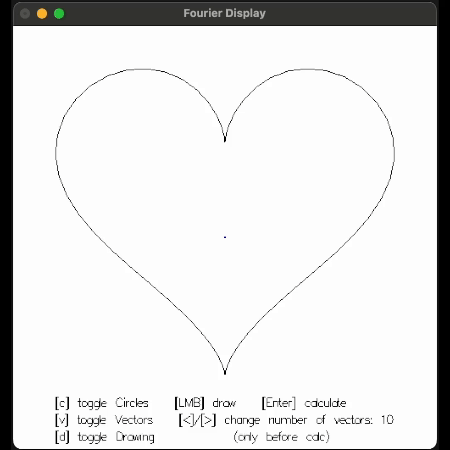
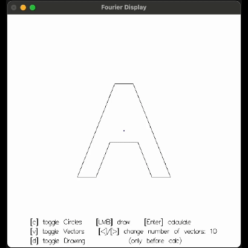
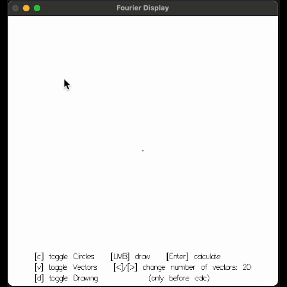
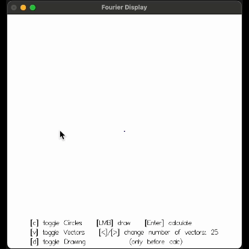

# Fourier Series
## A submission for the INF1A FP Competition 2024
#### by Arne Rönneberg

### Description
This projects is a simple implementation of the Complex Fourier Series and Transformation.
The Fourier Transformation aims to express any function (in 2D in this case) as an infinite sum of _sin_ and _cos_ functions.

The complex trigonometric functions making up the output, which can be thought of as rotating vectors, are being shown in the resulting image together with the path traced by the function.

#### Usage
The user can draw a path with `LMB` or select an example path with the number keys `1` to `2`. The degree of evaluation can be changed with the `left` and `right` arrow keys. Pressing `Enter` calculates the fourier coefficients and displays the resulting function.
The `v`, `c` and `d` keys can be used to toggle the visibility of different parts of the image

The simulation can be reset by pressing the `R` key.

Integration is performed by numeric evaluation of the Riemann sum and the `Gloss` package is used for implementation of graphics and input events, while the `Complex` package handles complex numbers.


### How to run
The app can be run by navigating to the folder and running
```cabal run```
which will create a window that can be closed using the `Esc` key.


### Examples






